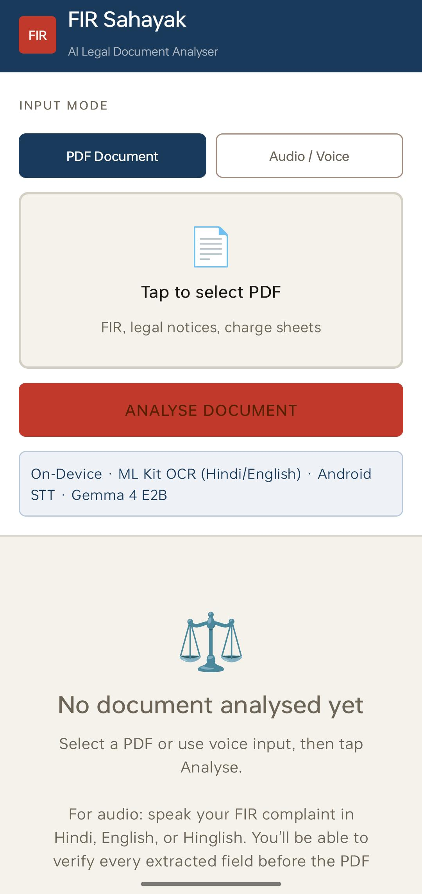
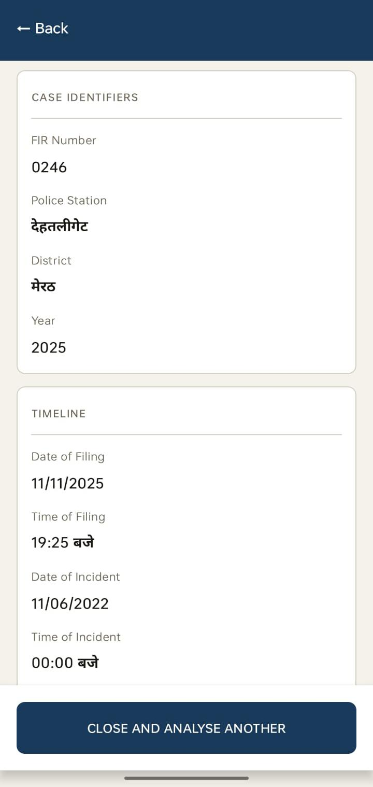
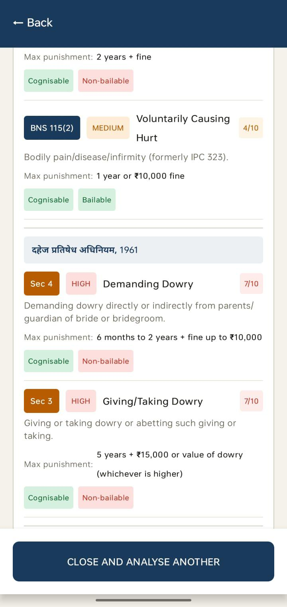
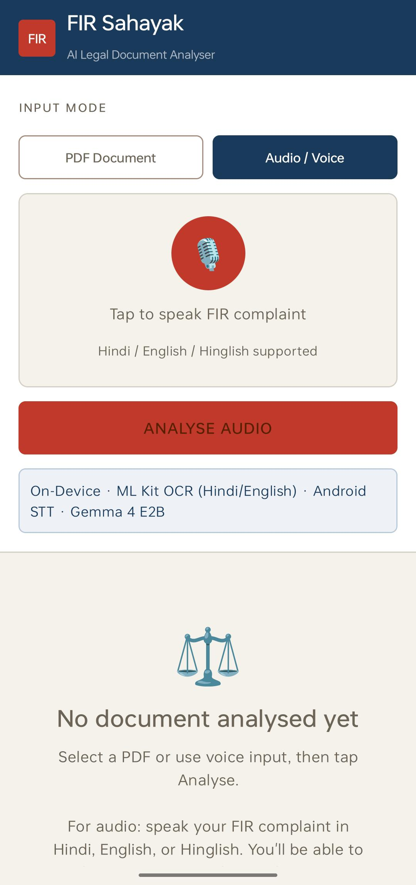
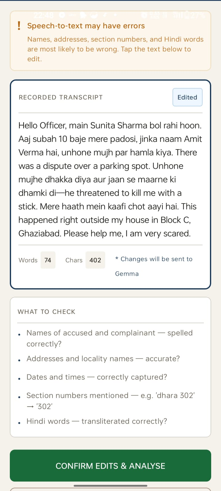
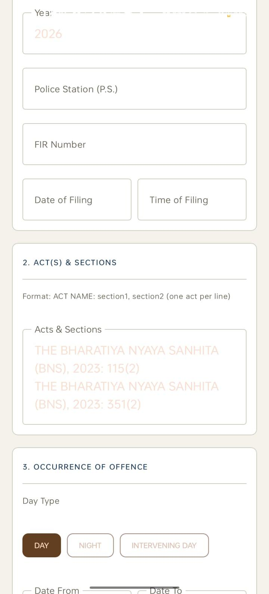

# FIR Sahayak 🇮🇳
### On-Device AI for Police FIR Digitisation in India

[](https://android.com)
[](https://ai.google.dev/gemma)
[](https://ai.google.dev/edge/litert-lm)
[](/)
[](/)
[](/)
[](https://www.kaggle.com/competitions/gemma-4-good-hackathon)

> Digitising India's 20 million annual FIRs using on-device Gemma 4 — from paper form or spoken complaint to structured legal record, no internet required.

---

## The Problem

India registers over **5.8 million FIRs annually** *(NCRB, 2024)*[https://www.google.com/url?sa=t&source=web&rct=j&opi=89978449&url=https://www.drishtiias.com/daily-updates/daily-news-analysis/ncrbs-crime-in-india-2024-report&ved=2ahUKEwijxvuW_rqUAxULRWcHHeoYDMkQFnoECCIQAQ&usg=AOvVaw1w6oHtVCZmW4HQxy4vKmI0], yet most police stations still rely on handwritten registers. The **CCTNS** *(Crime and Criminal Tracking Networks and Systems)* — the Ministry of Home Affairs' flagship mission to digitise all ~17,000 police stations — continues to face inaccurate data entry and fragmented records as core barriers.

- Officers must rapidly adapt to the new **Bharatiya Nyaya Sanhita (BNS) 2023**, which replaced the 160-year-old IPC with entirely renumbered sections
- Paper records prevent searchable databases, cross-case analytics, and repeat-offender detection
- Complainants have no visibility into whether the correct legal sections were applied

**FIR Sahayak bridges this gap** — transforming FIR processing into an intelligent, fully offline digital workflow using on-device AI.

---

## Screenshots

| Home Screen | PDF Result | Section Breakdown |
|---|---|---|
|  |  |  |

| Audio Input | Transcript Review | Verification UI |
|---|---|---|
|  |  |  |

---

## A Day With and Without FIR Sahayak

| Scenario | Without | With FIR Sahayak |
|---|---|---|
| Complaint arrives | Officer transcribes by hand | Audio recorded; entities extracted automatically |
| Section selection | Manual IPC/BNS lookup | App infers BNS sections from narrative |
| Form filling | All fields typed manually | Pre-populated from entity extraction |
| Ambiguous sections | Relies on experience | Flagged in amber for officer review |
| PDF generation | Re-typed by clerk, 20–40 min | Auto-generated in seconds |
| Complainant visibility | Cannot verify sections filed | Plain-language severity shown immediately |
| Rural stations | No cloud tools available | Fully offline after one-time model download |

---

## Features

<details>
<summary><b>📄 PDF Mode — Digitise Existing Paper FIRs</b></summary>

### What it does
Officer selects a scanned or photographed FIR PDF. The app runs ML Kit OCR, cleans the output, sends it to Gemma 4 E2B, and displays every extracted field as a structured, labelled record.

### Key flow
```
PDF/Camera → ML Kit OCR → Spatial Sort + Digit Normalizer
          → Gemma 4 E2B (streaming) → JSON Parser
          → Local Rule Engines → FIR Result Screen
```

### Key function signature
```kotlin
// FirRepository.kt
fun analyseFromPdf(uri: Uri): Flow<Progress>

// Progress sealed class
sealed class Progress {
    data class Status(val message: String) : Progress()
    data class Token(val token: String)    : Progress()   // streamed live
    data class Done(val result: JSONObject): Progress()
    data class Error(val message: String)  : Progress()
}
```

### What gets extracted
Every field of the official BNS FIR form — district, PS, FIR number, year, filing date/time, acts and sections per act, occurrence date/time range, GD reference, place of occurrence, complainant full particulars, accused entries, witnesses, property stolen, and FIR narrative contents.

</details>

---

<details>
<summary><b>🎙️ Audio Mode — Live FIR Registration from Spoken Complaint</b></summary>

### What it does
Officer records complainant's spoken account in Hindi, English, or Hinglish. The transcript appears for review and correction. Gemma then infers applicable BNS sections from the narrative — the officer does not need to know section numbers. Every field is editable before the FIR PDF is generated.

### Key flow
```
Audio Input → Android STT (hi-IN primary, en-IN fallback)
           → Transcript Review Screen (editable)
           → Gemma 4 E2B (streaming) → JSON Parser
           → Local Rule Engines → Verification UI
           → FIR PDF Generator
```

### Transcript Review Screen
Before anything is sent to Gemma, the officer and complainant can read the transcription and fix STT errors — especially names, addresses, and section numbers which are most likely to be misheard.

### Key function signature
```kotlin
// SttEngine.kt
suspend fun transcribeWithAndroidSTT(
    onPartialResult: (String) -> Unit = {}
): String   // runs on Dispatchers.Main — SpeechRecognizer requirement

// FirViewModel.kt
fun confirmTranscript(transcript: String)  // triggers Gemma analysis
fun reRecord()                             // goes back to Idle
```

### Section inference — audio prompt design
The audio system prompt instructs Gemma to:
- Infer the most applicable BNS punishment subsection from the narrative description
- Never return parent sections (e.g. return `303(2)` not `303`)
- Use greedy decoding (`temperature=0.01, topK=1, topP=0.0`) for deterministic output
- Scope to BNS 2023 sections only (multi-act audio support planned)

</details>

---

<details>
<summary><b>🔍 OCR Pipeline with Spatial Sorting</b></summary>

### Why standard ML Kit fails on FIR forms
FIR forms are multi-column printed tables. ML Kit returns text blocks in bounding-box order, not reading order — so "District | Year | P.S." on one row gets interleaved with rows above and below it. Additionally, ML Kit occasionally misreads printed Latin `8` as Bengali `৪` (which represents `4`), silently corrupting section numbers like `85` → `45`.

### Two-pass spatial sort
```
Step 1 — Collect all text lines with bounding box centre-Y
Step 2 — Sort lines by centre-Y
Step 3 — Group into horizontal bands (centre-Y within 40px = same row)
Step 4 — Within each band, sort left → right by bounding box left edge
Step 5 — Join cells in same band with "  |  " separator
Step 6 — Join bands with newline → structured pipe-delimited text for Gemma
```

### Key function signature
```kotlin
// OcrEngine.kt
suspend fun ocrBitmapSpatial(bitmap: Bitmap): String

// Band grouping logic (pseudocode)
for (line in allLinesSortedByY) {
    if (lastBand == null || line.centreY - lastBand.first().centreY > ROW_BAND_PX) {
        bands.add(newBand(line))   // new row
    } else {
        lastBand.add(line)         // same row
    }
}
```

### Devanagari/Bengali digit normalizer
```kotlin
// FirRepository.kt — normalizeDigits()
'৪' -> '8'   // Latin 8 misreads as bengali 8 which LLM takes as 4.
'৮' -> '8'   // Bengali 8
'०' -> '0'   // Devanagari digits
'१' -> '1'
// ... all Devanagari, Bengali, and Extended Arabic-Indic digits mapped
```

### OCR act/section merge cleaner
When OCR splits an act name and its section number across two lines due to column boundaries, the cleaner detects act-name keywords and re-joins them:
```
Input:  "भारतीय न्याय संहिता (बी एन एस), 2023"  [next token] "351(2)"
Output: "भारतीय न्याय संहिता (बी एन एस), 2023  |  351(2)"
```

</details>

---

<details>
<summary><b>🤖 Gemma 4 E2B Integration + Token Streaming</b></summary>

### Model setup
```kotlin
// LlmEngine.kt
val config = EngineConfig(
    modelPath     = modelPath,
    backend       = Backend.CPU(),
    cacheDir      = context.cacheDir.path,
    maxNumTokens  = 8192
)
val engine = Engine(config)
engine.initialize()
```

### Why greedy decoding
FIR extraction is not a creative task. The same input must always produce the same structured output. Greedy decoding eliminates stochastic variation that could change section numbers, names, or dates between runs.
```kotlin
val samplerConfig = SamplerConfig(
    temperature = 0.01,
    topK        = 1,
    topP        = 0.0
)
```

### Token streaming via channelFlow
Standard `flow {}` forbids emitting from a different coroutine context. Since LiteRT inference runs on `Dispatchers.IO`, `channelFlow` is used so tokens can be sent cross-context safely:
```kotlin
// FirRepository.kt
fun analyseFromPdf(uri: Uri): Flow<Progress> = channelFlow {
    llm.extractFirEntities(text, "pdf") { token ->
        rawJson += token
        send(Progress.Token(token))   // safe across Dispatchers.IO → Main
    }
}
```

### Two system prompts
| Prompt | Purpose |
|---|---|
| `FIR_SYSTEM_PROMPT_PDF` | OCR artefact handling, pipe-delimited input parsing, multi-act section extraction |
| `FIR_SYSTEM_PROMPT_AUDIO` | Hindi/Hinglish narration, BNS section inference from narrative description |

### Why Gemma 4 E2B on LiteRT is the right choice
The app must run offline on a ₹12,000 Android device, handle mixed Hindi/English/Hinglish input, produce deterministic legal output, and process sensitive police data without any cloud dependency. Gemma 4 E2B via LiteRT satisfies all four constraints simultaneously — CPU inference, multilingual pretraining, on-device footprint, and open distribution.

</details>

---

<details>
<summary><b>🔧 Robust JSON Parser</b></summary>

### The problem
Gemma 4 E2B on CPU occasionally produces partially-formed JSON — standalone commas, unquoted mixed strings, truncated arrays — especially for long FIR documents. Any single parse failure would break the entire extraction.

### Repair pipeline
```
Step 1 — Strip markdown fences (```json ... ```)
Step 2 — Find first '{' — discard any preamble
Step 3 — Find last '}' — discard any trailing tokens
Step 4 — Attempt full JSONObject parse
Step 5 — If failed: apply structural regex fixes, retry
Step 6 — If still failed: extract field-by-field as fallback
Step 7 — Sanitise occurrence fields (date/time swap detection)
Step 8 — Merge regex pre-extraction hints for any fields Gemma missed
```

### Regex pre-extraction (hint layer)
Before Gemma runs, a regex pass extracts high-confidence fields as fallback hints:
```kotlin
// FirRepository.kt — regexExtract()
Regex("""\b(\d{1,2}[/\-]\d{1,2}[/\-]\d{4})\b""")         // dates
Regex("""\b(\d{1,2}:\d{2})""")                             // times
Regex("""(?:FIR\s*No\.?)\s*[:\-]?\s*(\d{3,6})""")        // FIR number
Regex("""\b([6-9]\d{9})\b""")                              // phone numbers
```
These hints are merged into the final JSON only if Gemma left those fields blank.

</details>

---

<details>
<summary><b>⚖️ Legal Rule Engines — BNS Severity DB + OtherActs DB</b></summary>

### Why local databases override Gemma for severity
Gemma is reliable for entity extraction but unreliable for legal severity scoring — it may assign a score of 3/10 to a combination of sections that legally warrants 9/10. The local databases provide deterministic, legally accurate scoring that cannot hallucinate.

### BNS Severity DB — 350+ sections
Each entry contains:
```kotlin
data class BnsEntry(
    val section       : String,        // e.g. "103(1)"
    val shortTitle    : String,        // e.g. "Punishment for Murder"
    val definition    : String,        // plain-language one-liner
    val severity      : SeverityLevel, // LOW / MEDIUM / HIGH / CRITICAL
    val cognisable    : Boolean,       // can police arrest without warrant?
    val bailable      : Boolean,       // does accused have right to bail?
    val maxPunishment : String,        // e.g. "Death or Life imprisonment"
    val urgencyPoints : Int            // 0 = minor; 10 = immediate action required
)
```

### Severity computation
```
score = highest urgencyPoints among all matched sections
score += 0.5 for each additional section with urgencyPoints >= 7
score += 1.0 if any conspiracy section (BNS 61) is present
finalScore = clamp(score, 1, 10)
level: 1–3 = LOW, 4–5 = MEDIUM, 6–7 = HIGH, 8–10 = CRITICAL
cognisable = true if ANY section is cognisable
bailable   = false if ANY section is non-bailable
```

### Plain-language field explanations
| Field | What it means in plain language |
|---|---|
| **Cognisable** | Police can arrest without a magistrate's warrant — immediate action possible |
| **Non-cognisable** | Police must obtain a warrant before arrest |
| **Bailable** | Accused has a legal right to bail |
| **Non-bailable** | Bail is at the court's discretion — accused may be detained |
| **Urgency score 0** | Low urgency — minor or civil in nature |
| **Urgency score 10** | Immediate action required — heinous offence, victim at risk |

### OtherActs Severity DB — 10 additional acts
```
Dowry Prohibition Act 1961  |  POCSO 2012
SC/ST Atrocities Act 1989   |  IT Act 2000
Arms Act 1959               |  NDPS Act 1985
UAPA 1967                   |  Muslim Women Acts (Marriage + Divorce)
Domestic Violence Act 2005  |  Juvenile Justice Act 2015
```
Act type is detected from the act name string using substring pattern matching (handles Hindi, English, and transliterated variants).

### Multi-act severity in PDF mode
```
overallScore     = max(bnsScore, max of all otherAct scores)
overallCognisable = bns.cognisable OR any(otherActs.cognisable)
overallBailable   = bns.bailable  AND all(otherActs.bailable)
```

</details>

---

<details>
<summary><b>📋 Verification UI — Human-in-the-Loop Before Any Record Is Finalised</b></summary>

### Design principle
The app never generates a PDF or finalises a record without explicit officer confirmation. Every field extracted by Gemma is shown in an editable form. This respects the officer's authority over the legal record and prevents AI extraction errors from becoming legal errors.

### Field highlighting
- **Amber border + amber label** — field was flagged as uncertain by Gemma (e.g. section not found in BNS DB, or conflicting values detected)
- **Normal blue border** — field extracted with confidence
- All fields editable regardless of confidence level

### Acts editing
Acts and sections are edited as plain text in the format:
```
ACT NAME: section1, section2
```
One act per line. On confirmation, severity is recomputed from the edited sections so the final PDF always reflects the officer's confirmed data, not Gemma's raw extraction.

### On confirm — severity recomputed
```kotlin
// FirVerificationScreen.kt — buildFirEntity()
val allSections = acts.flatMap { it.sections }
val dbResult    = BnsSeverityDb.computeSeverity(allSections)
// severity in the final FirEntity always reflects confirmed sections
```

</details>

---

<details>
<summary><b>📄 FIR PDF Generator</b></summary>

### What it produces
A pixel-accurate reproduction of the official BNS FIR form (under Section 173 B.N.S.S.) as an Android `PdfDocument`, shareable via any installed app.

### Layout approach
```
Page geometry: A4 @ 72 dpi = 595 × 842 pts
Margins: ML=42, MR=42, MT=36, MB=52
Content width: 511 pts

Sections rendered:
  Title block → Section 1 (Case identifiers)
  → Section 2 (Acts & Sections)
  → Section 3 (Occurrence — day/date/time, GD reference)
  → Section 4 (Type of information)
  → Section 5 (Place of occurrence)
  → Section 6 (Complainant full particulars)
  → Section 7 (Accused table with vertical column lines)
  → Section 8 (Delay reason)
  → Section 9/10 (Property stolen + total value)
  → Section 11 (Inquest report)
  → Section 12 (FIR contents — wrapped prose)
  → Signature block (pinned to page bottom)
```

### Multi-page handling
`DrawState` tracks current Y position. When content would overflow `SAFE_Y = PH - MB - 18f`, it automatically finishes the current page and starts a new one — so long FIR narratives never get clipped.

### Key function signature
```kotlin
// FirPdfGenerator.kt
suspend fun generate(context: Context, entity: FirEntity): File
// Returns file in app private storage — shared via FileProvider
```

</details>

---

<details>
<summary><b>🏗️ App Architecture</b></summary>

### Data Binding Architecture with StateFlow
```
FirViewModel (AndroidViewModel)
    │
    ├── FirRepository
    │       ├── OcrEngine      — ML Kit OCR + spatial sort
    │       ├── SttEngine      — Android SpeechRecognizer
    │       └── LlmEngine      — Gemma 4 E2B via LiteRT
    │
    └── UiState (sealed class, StateFlow)
            ├── Idle
            ├── NeedDownload
            ├── Downloading(percent)
            ├── Loading(message)
            ├── TranscriptReview(transcript)
            ├── Streaming(message, tokens)   ← live token display
            ├── Verification(entity)         ← audio path
            ├── PdfReady(entity, file)
            ├── Success(result)              ← PDF path
            └── Failure(error)
```

### Data model
```kotlin
data class FirEntity(
    val district         : String,
    val policeStation    : String,
    val firNumber        : String,
    val acts             : List<ActEntry>,        // act name + sections
    val occurrence       : OccurrenceDetails,     // date/time range, GD ref
    val place            : PlaceOfOccurrence,     // address, direction, beat
    val complainant      : Complainant,           // full particulars
    val accused          : List<AccusedEntry>,
    val witnesses        : List<String>,
    val propertyStolen   : List<PropertyEntry>,
    val firContents      : String,
    val severity         : SeverityInfo,          // computed locally
    val uncertainFields  : List<String>           // amber-flagged fields
)
```

### Model download
```kotlin
// ModelDownloader.kt
// Dev mode:  adb push model.litertlm /data/local/tmp/llm/
// Production: downloads from HuggingFace with resume support
fun getModelPath(context: Context): String?   // null → NeedDownload state
suspend fun downloadModel(context: Context, onProgress: (Int) -> Unit)
```

</details>

---

## Installation

<details>
<summary><b>Prerequisites</b></summary>

- Android Studio Hedgehog or later
- Android device or emulator running API 24+ (Android 7.0+)
- Minimum 3GB RAM on device (for Gemma 4 E2B inference)
- ~2GB free storage (1.5GB model + app)
- ADB installed and device in developer mode (for dev model push)

</details>

<details>
<summary><b>Step 1 — Clone the repository</b></summary>

```bash
git clone https://github.com/sahiljain77777/fir-sahayak.git
cd fir-sahayak
```

</details>

<details>
<summary><b>Step 2 — Open in Android Studio</b></summary>

1. Open Android Studio
2. **File → Open** → select the `fir-sahayak` folder
3. Wait for Gradle sync to complete
4. Android Studio will download all dependencies automatically

</details>

<details>
<summary><b>Step 3 — Get the Gemma 4 E2B model</b></summary>

The model file (`gemma-4-E2B-it.litertlm`, ~1.5GB) is **not included in the repo** (exceeds GitHub's file size limit).

**Option A — ADB push (development, fastest):**
```bash
# Download the model from HuggingFace first
# https://huggingface.co/litert-community/gemma-4-E2B-it-litert-lm

adb shell mkdir -p /data/local/tmp/llm/
adb push gemma-4-E2B-it.litertlm /data/local/tmp/llm/
```

**Option B — In-app download (production):**
- Launch the app
- Tap **Download Gemma Model** when prompted
- The app downloads directly to device storage with resume support

</details>

<details>
<summary><b>Step 4 — Build and run</b></summary>

```bash
# Connect your Android device via USB with developer mode enabled
# Or start an emulator (API 24+)

# From Android Studio:
# Run → Run 'app'   (or Shift+F10)

# From terminal:
./gradlew installDebug
```

**Permissions required at first run:**
- `RECORD_AUDIO` — for voice input mode
- `READ_EXTERNAL_STORAGE` — for PDF selection

</details>

<details>
<summary><b>Step 5 — First launch</b></summary>

1. App launches → checks for model at ADB path or app storage
2. If found → initialises Gemma (~10–30s on first run)
3. If not found → shows download prompt
4. Once initialised → home screen with PDF and Audio tabs

**To test PDF mode:** Select any scanned FIR PDF from device storage

**To test Audio mode:** Tap the microphone → speak a complaint in Hindi or English → review transcript → confirm → verify extracted fields → generate PDF

</details>

---

## Technical Stack

| Component | Technology |
|---|---|
| Platform | Android API 24+ · Kotlin · Jetpack Compose |
| LLM | Gemma 4 E2B · Google AI Edge LiteRT (CPU) |
| OCR | ML Kit Text Recognition — Latin + Devanagari |
| STT | Android SpeechRecognizer API |
| PDF Input | Android PdfRenderer |
| PDF Output | Android PdfDocument |
| Storage | On-device only — zero cloud |

---

## Limitations and Roadmap

| Current Limitation | Planned Fix |
|---|---|
| Hindi STT requires internet (Android SpeechRecognizer) | On device STT — fully offline audio path |
| Audio mode infers BNS sections only | Multi-act audio inference (BNS + POCSO, Dowry Act, etc.) |
| Structured output is UI display only | JSON export + CCTNS database integration |
| Hindi and English only | Punjabi,Tamil, Telugu, Bengali, Marathi OCR and voice |

---

## Impact

~17,000 police stations · Zero backend infrastructure · Play Store or APK distribution at zero marginal cost per station

The structured entity extraction this app produces today is the foundation on which searchable FIR databases, CCTNS integration, and data-driven policing can be built tomorrow.

---

## Hackathon

Built for the **[Gemma 4 Good Hackathon](https://www.kaggle.com/competitions/gemma-4-good-hackathon)** · Track: Digital Equity & Inclusivity

**[📄 Full Technical Write-Up on Kaggle](https://www.kaggle.com/competitions/gemma-4-good-hackathon/writeups/fir-sahayak-on-device-ai-for-police-fir-digitisat)**

---

*Built with Gemma 4 E2B · Google AI Edge LiteRT · ML Kit OCR · Android SpeechRecognizer · Jetpack Compose*
*All inference on-device · Zero data transmitted or stored externally*
